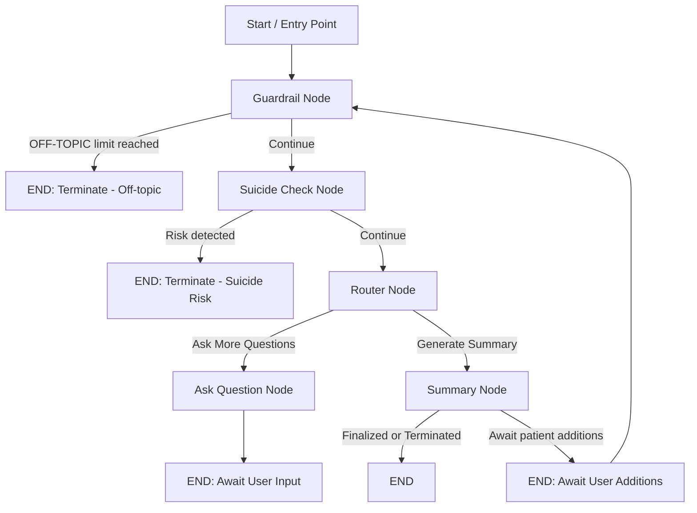
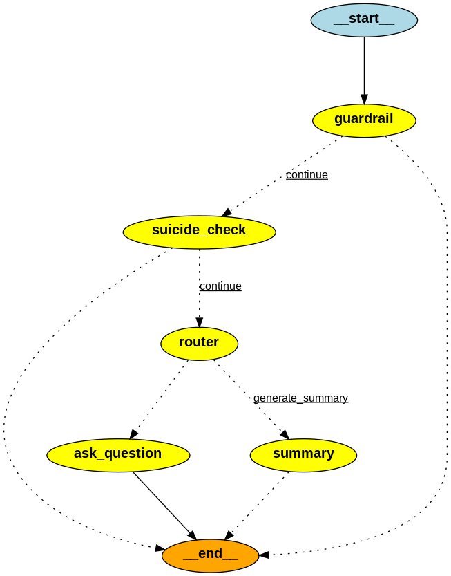

# Documentation: `src/bot/graph.py`

This document explains in detail the **structure and functioning** of the `graph.py` module, which orchestrates an AI-driven conversation around **sleep-related health consultations**.  
It integrates **LangGraph** state graphs with **LangChain** LLM prompt pipelines to enable smart, stateful, safe, and procedurally guided dialogues.

---

## 1. Purpose

The `graph.py` script defines a **state machine** for the chatbot that:

1. Starts conversations with a patient (optionally using a referral letter).
2. Ensures patient input **stays on-topic** (sleep-related).
3. Performs **safety checks** for self-harm risk.
4. Dynamically decides whether to **ask questions** or **generate a professional summary**.
5. Handles conversation flow persistently using a SQLite checkpointing system.

---

## 2. Key Components

### 2.1 Dependencies
The script imports several key libraries and modules:

- **LangChain Core**: 
  - [`HumanMessage`](https://api.python.langchain.com/en/latest/messages/langchain.schema.HumanMessage.html)
  - [`AIMessage`](https://api.python.langchain.com/en/latest/messages/langchain.schema.AIMessage.html)
  - [`ChatPromptTemplate`](https://api.python.langchain.com/en/latest/prompts/langchain.prompts.chat_prompt_template.ChatPromptTemplate.html)
- **LangChain OpenAI**: [`ChatOpenAI`](https://api.python.langchain.com/en/latest/modules/chat_models/langchain.chat_models.openai.html)
- **LangGraph**: 
  - [`StateGraph`](https://github.com/langchain-ai/langgraph) (for defining state transitions)
  - `END` terminal constant
  - `SqliteSaver` checkpoint backend
- **Custom Project Modules**:
  - `GraphState` (state schema definition)
  - Pydantic data models: `GuardrailDecision`, `SuicideCheckDecision`, `SleepSummary`, `RouterDecision`
  - Prompt helper functions for system and human messages
- **Persistence**: `sqlite3` to store conversation states

---

## 3. LLM Configuration

Two LLM instances are initialized:

```python
llm = ChatOpenAI(model="gpt-4o")
llm_summary = ChatOpenAI(model="gpt-4o", max_tokens=3000)
```

- **`llm`** → General dialogue & classification tasks.
- **`llm_summary`** → Summary generation with more tokens for detailed outputs.

---

## 4. Graph Nodes

The LangGraph is based on **nodes** that mutate `GraphState`.  
Nodes return **partial state updates**, merged into the persistent conversation state.

### 4.1 Guardrail Node
Ensures conversation stays **on-topic (sleep health)**.

- Uses structured LLM output (`GuardrailDecision`) for classification.
- Maintains an `off_topic_counter`.
- After 3 off-topic responses, terminates with a warning.

**Prompt Components**:
- System: `get_guardrail_prompt()`
- Human: User message + classification instructions.

---

### 4.2 Suicide Check Node
Performs a **safety check** to detect self-harm/suicidal intent.

- Looks at last 5 messages.
- Structured output: `SuicideCheckDecision`.
- If **risk detected** at medium/high/immediate → Terminates conversation.
- Custom safety messages based on severity.

**Prompt Components**:
- System: `get_suicide_check_prompt()`
- Human: Last 5 messages as conversation context.

---

### 4.3 Ask Question Node
Asks **sequential consultation questions**.

- If starting conversation → Uses `get_initial_question_prompt()` with referral letter context.
- Else → `get_followup_question_prompt()` with conversation history.

**Prompt Components**:
- System: `get_ask_question_system_prompt()`
- Human: Initial or follow-up prompt.

Tracks:
- `last_question` for guardrail recovery.
- Increment `questions_answered` when on-topic.

---

### 4.4 Summary Node
Generates **summaries** for both the **patient** and **doctor**.

2 Modes:
1. **Initial summary** (after enough questions, confirmation pending).
2. **Final summary** (after patient modifications).

Structured output: `SleepSummary` with:
- `doctor_summary`
- `patient_summary`
- `urgency_level`

Fallback: If structured output fails → plain LLM text.

---

## 5. Router Logic

Controls flow between:
- **"ask_question"**
- **"generate_summary"**

**Logic Steps**:
1. If summary already confirmed → `generate_summary`.
2. If < 5 questions answered → Continue questions.
3. Else → Let `RouterDecision` AI decide (context-aware).

---

## 6. Termination Check
`should_terminate` function:
- Ends conversation if `terminate_reason` exists in state.

---

## 7. Graph Construction

```python
graph_builder = StateGraph(GraphState)

graph_builder.add_node("guardrail", guardrail_node)
graph_builder.add_node("suicide_check", suicide_check_node)
graph_builder.add_node("ask_question", ask_question_node)
graph_builder.add_node("summary", summary_node)
graph_builder.add_node("router", router_node)
```

### Edges:
- entry → **guardrail**
- guardrail → suicide_check OR END
- suicide_check → router OR END
- router → ask_question OR summary
- ask_question → END (await new input)
- summary → END OR continue for edits

---

## 8. Persistence

Uses `SqliteSaver` to store full conversation state in **`conversations.sqlite`**, keyed by `thread_id`.

---

## 9. Conversation Loop

The CLI entry point (`main_loop`):

1. Ask for `user_id`.
2. Optionally request referral letter.
3. Start conversation with personalized or default greeting.
4. Resume past sessions if no new referral provided.
5. Stream graph events until conversation termination.

---

## 10. Prompts

Prompts are **template-driven**, combining:
- **System Messages**: Define AI’s role & guidelines.
- **Human Messages**: Context (conversation history, referral letter).

They are provided by `helper.py` functions for consistency.

---

## 11. Key Takeaways

- **Safety-first** → Guardrail & Suicide Check always run first.
- **Dynamic flow** → Router logic + patient input determine direction.
- **Persistent** → Conversations resume mid-way even after interruptions.
- **Contextualized** → Referral letters greatly improve question relevance.
- **Dual output** → Summaries tailored both for medical professionals and patients.

---

## 12. Visual Flow Diagram (Detailed)



This **Mermaid diagram** illustrates the path branching and termination logic.

---

## 13. Graph Visualization (Generated)

Below is the actual **graph image** generated when running `graph.py` as the main module:



This PNG is built dynamically by `app.get_graph().draw_png()` during startup, ensuring it matches the code's current logic.

Maintained across nodes; can include:
- `messages` (chat history)
- `off_topic_counter`
- `questions_answered`
- `last_question`
- `terminate_reason`
- `summary_confirmed`
- `referral_letter`
- `doctor_summary`
- `patient_summary`
- `urgency_level`

---

## 14. Extensibility
Possible improvements:
- Add multilingual support in prompts.
- Save LLM reasoning metadata for audits.
- Include sentiment analysis tracking.